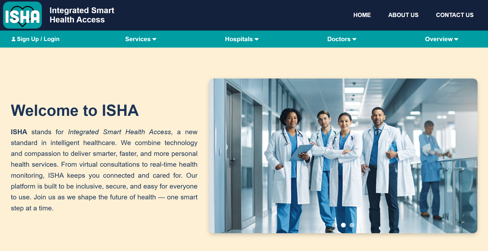
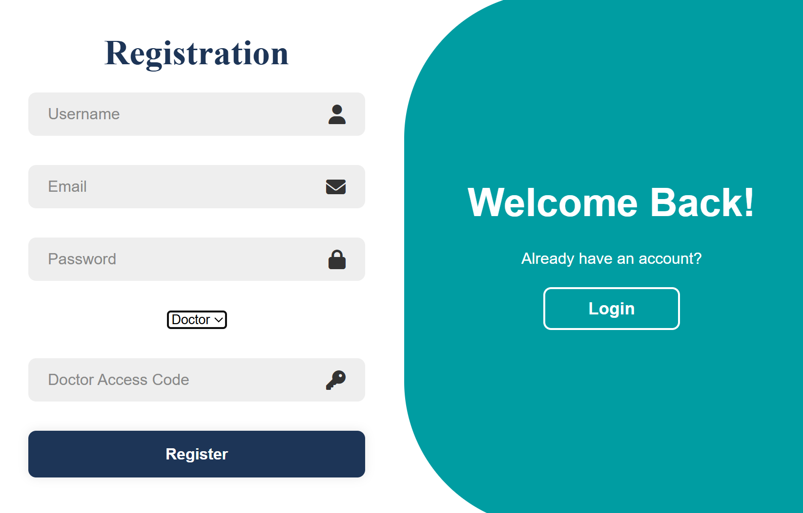

# ISHA Healthcare Website

A **responsive healthcare website clone** built using **HTML, CSS, JavaScript, PHP and MySQL**.  
This project showcases frontend design skills with modern layouts, interactive pages, and mobile-friendly responsiveness.

---

## 🌐 Live Demo
[View Website](http://navajowhite-woodcock-832679.hostingersite.com/index.html)

---

## ⚡ Features
- Responsive homepage and navigation  
- Appointment booking page UI  
- Login & Signup pages  
- Styled header, footer, and overall layout  

---

## 📷 Screenshots
  


---

## 🚀 How to Run Locally
1. Clone the repository:  
```bash
git clone https://github.com/Gandharv3352/ISHA_NHS_CLONE.git
